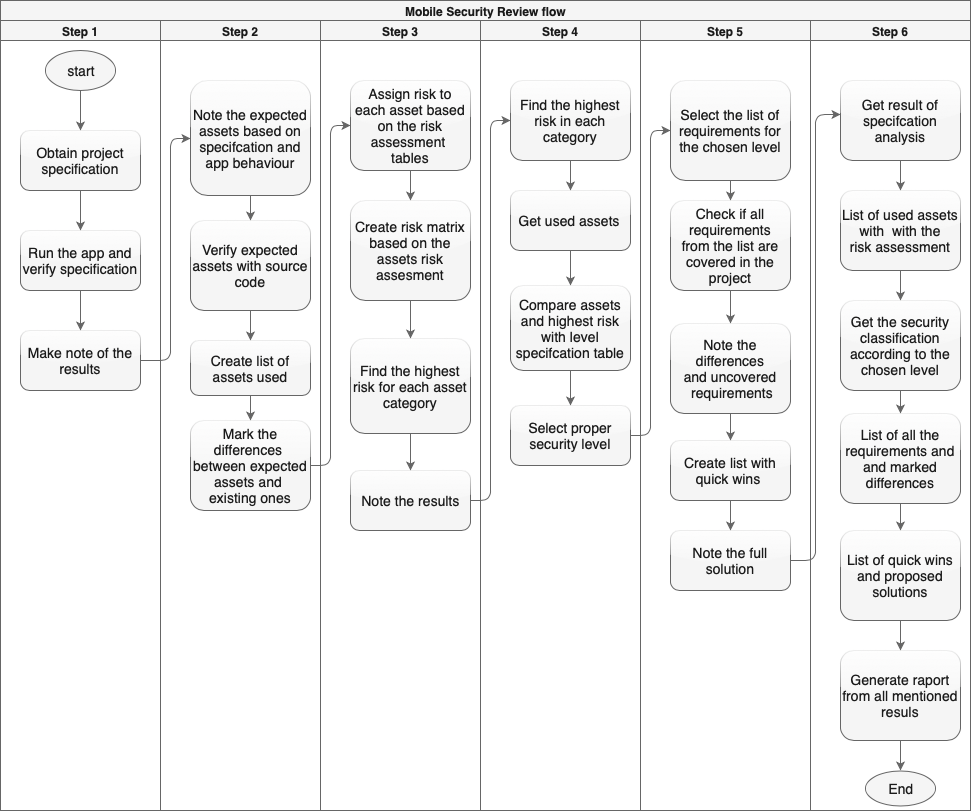

# Introduction

This document contains a full description of Netguru’s security review process for mobile projects. The document is split into three basic chapters:
* Risk analysis
* Security classification
* Security requirements 

The risk analysis section contains lists and description of essential elements that are required to define potential security problems related with the project. The lists of all elements used to define risk assessments are created based on the characteristics of mobile applications that may have influence on project security, e.g. data types, communication methods or used permissions. The result of risk analysis allows to select assets that concern the project under analysis and find a general risk level of the project. Also, this process allows us to find the level of potential impact on the user or client in case of security breach.
Next section – Security classification – contains description of both security levels and processes of project classification. Security classification results in assigning one of the described security levels to an analysed project. Correct level need to be defined based on the risk assessment that should be performed based on the guidelines described in Risk analysis section. 
The last section contains requirements concerning data security for each of the levels described in Security classification section. This chapter contains a list of necessary security elements that should be implemented on each security level. 

### Purpose

The purpose of a security project review is to find risk related to data processed by the application and define rules and security requirements that a project should comply with. Requirements and risk levels were created on the basis of international standards and good practices related to data security. The main goal is to verify if the analysed project complies with defined requirements.

### Inputs

A full analysis of the app can be performed only with all the required elements. Required inputs for the mobile review process include:
* Application file
* General app description
* Integrations description
* Source code

The application (e.g. APK file) and a description are required to analyse the app behaviour and find what kind of data is processed in the application. The description of all the integrations is required to define communication methods and potential sources of data leaks. 
The last required element is the application’s source code, this allows us to find potential security bugs in the project and create a list of security elements that should be implemented in the app. List of implemented elements allows to verify if the list met the expected requirements that should be implemented in the project. Mentioned elements should be treated as the inputs for the Mobile security process
### Aspects used to determine the Security level
The security review process is very important because of the influence that implemented security elements have on the data processed in the app. To precisely determine security levels and adjust security requirements, reviewer needs to be aware of these aspects:
* Type of data being processed
* What kind of user is the app designed for
* Primary/Secondary app purpose
* Application category
* Communication type
* External integrations
* Device permissions (Android, peripherals/sensors access) or capabilities (iOS) being used 
* Tools used

Mentioned aspects are distinctive for the mobile projects and they influence the process of defining security levels.
### Method
This section contains a step-by-step description of the process, as well as an overview of the tools that have to be used during the process realization.
####Steps
Netguru’s mobile security review process consists of the following steps:
1. Project assumptions analysis
1. Creating project assets list
1. Creating risk analysis and risk assessments for asset list
1. Security level classification
1. Security requirements verification
1. Report creation

The order of the steps above is crucial for the whole process. Performing a security review in this strict order allows to prepare a proper risk estimation. Such estimation and assessments of the risk allows to easily find threats in the project and select the proper requirements based on the selected security level.
### Flow
The diagram presented below contains a complete Mobile Security Review flow with all the activities in each step.

#### Tools
Experience in mobile development is one of the highest importance when selecting a developer to perform the review. Such experienced reviewer can easily find all the assets that the project is based on to create proper assumptions and furthermore find potential threats and bugs in implementation that may affect the security. 
A list of requirements and Netguru mobile security checklist are both important tools for the reviewer and allow the proper verification of security elements that should be implemented in the project based on the selected security level.
Another set of aids for the review process are static code analysis tools that automatically find potential threats, e.g. SonarQube.
Many tools used in penetration testing may also be very helpful e.g. deobfuscators, reverse engineering tools, app analysers (e.g. QARK or MobSF), online debuggers, memory analysers/dumpers, app profilers, proxy tools, communication sniffers, etc.
The most comprehensive source for mobile security is [Mobile Security Testing Guide](https://github.com/OWASP/owasp-mstg) by The OWASP Foundation. It is strongly recommended to read the book or at least chapters related to general and platform-specific mobile security before start working on a mobile application review.
The tools mentioned above are required to form a big picture of the whole project and the threats related to processing data. Furthermore, they help in estimating the possible impact on the client and app users in case of security breach, as well as speed up the process of selecting proper security level and creating security requirements.

#### Results

The results of the process should be presented as report containing the full results of the analysis with proper description. The following sections should be provided:
Security classification containing a set of requirements that the project should obey depending on security level assigned earlier
Verification of security requirements implementation, also containing a list of security breaches and missing security elements
Quick wins and general suggestions regarding the security improvements that should be implemented to comply with certain security levels requirements
